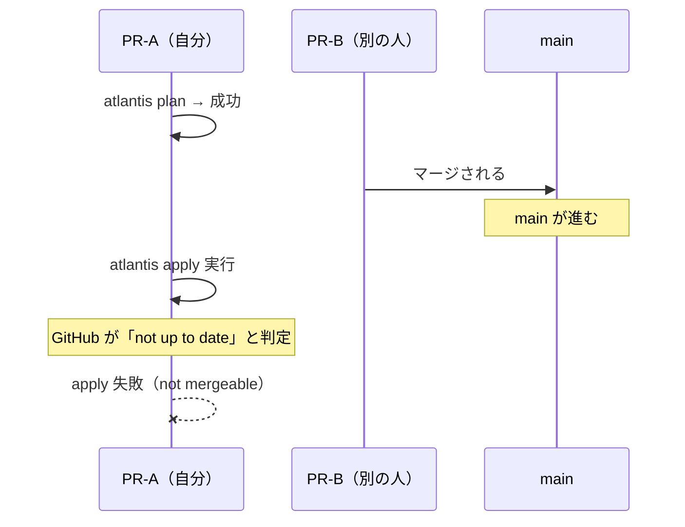
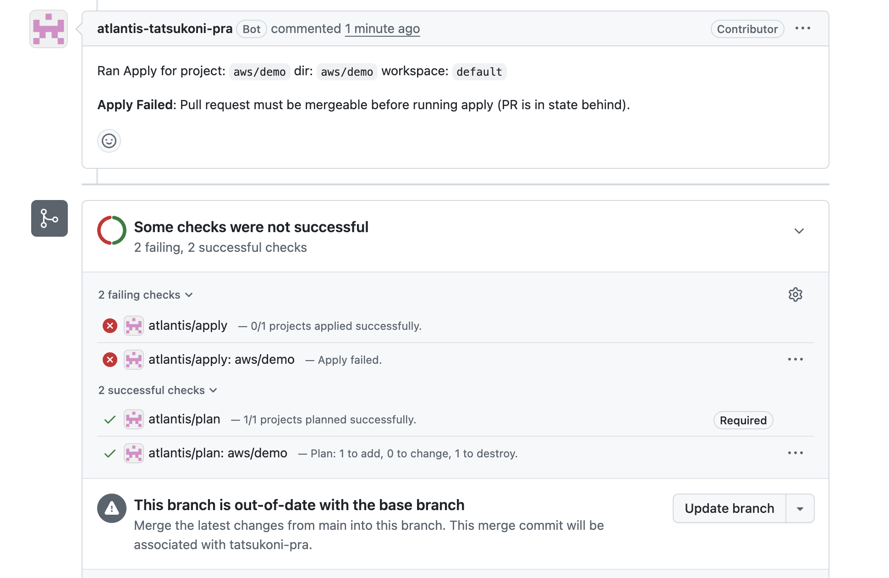

# Atlantis Apply 時の最新ブランチチェック

PR が最新の main ブランチを取り込んでいない場合に `atlantis apply` を失敗させる設定手順。

## 概要

GitHub の Branch Protection Rules と Atlantis の `apply_requirements: [mergeable]` を組み合わせることで実現する。

- **GitHub 側**: main より遅れている PR を「not mergeable」にする
- **Atlantis 側**: mergeable でない PR の apply を拒否する

## 手順

### 1. GitHub Branch Protection Rules の設定

対象リポジトリの **Settings → Branches → Add branch protection rule** で以下を設定する。

| 項目 | 設定 |
|------|------|
| Branch name pattern | `main` |
| Require status checks to pass before merging | 有効 |
| Status checks | `atlantis/plan` を追加 |
| Require branches to be up to date before merging | 有効 |

> **注意**: 「Require branches to be up to date before merging」は、単独では有効にならない。この設定は「必須の status check が最新のコミット（main を取り込んだ状態）で通っているかどうか」で判定されるため、判定基準となる status check が最低1つ必要になる。

### 2. Atlantis の apply_requirements 設定

`infra/atlantis/values.yaml` の `repoConfig` に `mergeable` を追加する。

```yaml
repoConfig: |
  ---
  repos:
  - id: /.*/
    apply_requirements: [mergeable]
```

`mergeable` は、`atlantis apply` 実行時に PR が GitHub 上でマージ可能な状態かどうかをチェックする。Branch Protection Rules が未設定の場合は「コンフリクトがないこと」のみで判定される。Branch Protection Rules を設定すると、以下の設定などを適用できる。

- Requiring certain status checks to be passing
- Requiring certain people to have reviewed and approved the pull request
- Requiring CODEOWNERS to have reviewed and approved the pull request
- **Requiring that the branch is up-to-date with main**

> **補足**: Atlantis はデフォルトで、Terraform ファイルに変更がない PR でも `atlantis/plan — 0/0 projects planned successfully` として status check を送信する（成功扱い）。そのため、`atlantis/plan` を必須 status check に設定しても、Terraform 以外のファイルのみを変更した PR がマージ不可になることはない。この挙動を無効にしたい場合は `--silence-vcs-status-no-plans` フラグを使用する。
>
> 参考:
> - [Server Configuration - --silence-vcs-status-no-plans](https://www.runatlantis.io/docs/server-configuration)
> - [GitHub Issue #954 - Autoplan should only set commit status if it finds a project](https://github.com/runatlantis/atlantis/issues/954)

## 動作の流れ



1. PR を作成し `atlantis plan` を実行 → plan 成功
2. 別の PR が先に main にマージされる → main が進む
3. この PR で `atlantis apply` を実行
4. GitHub が PR を「not up to date」=「not mergeable」と判定
5. Atlantis が mergeable チェックに失敗し、apply を拒否

```
Apply Failed: Pull request must be mergeable before running apply (PR is in state behind).
```


